<h1>MyClinic Web</h1>

In this application you can manage you clinic, your schedule, your profile and your employees, also, the clients can use this version. They can create profile, read notifications, create another one and they can manage his account and cancel appointments

<h3>I did this application with react, redux and redux saga</h3>
 

  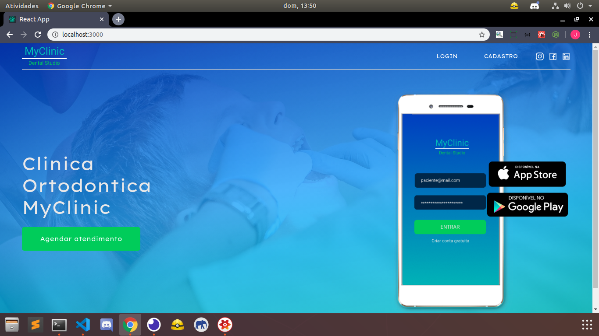
  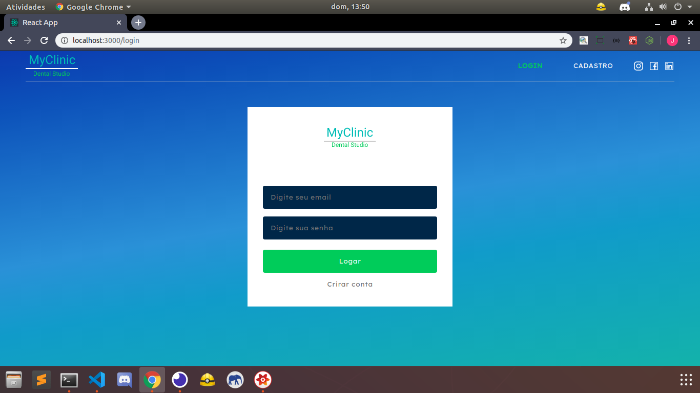
  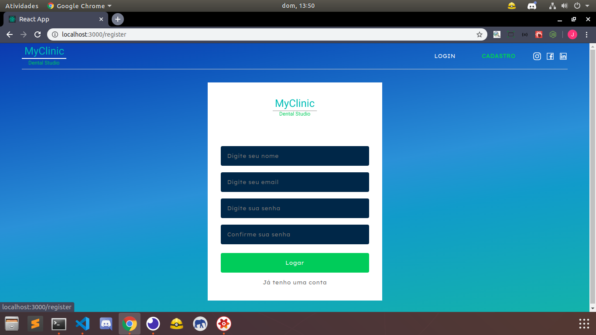
  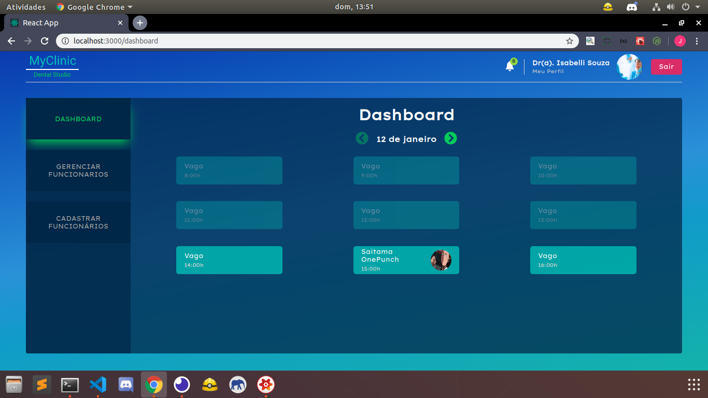
  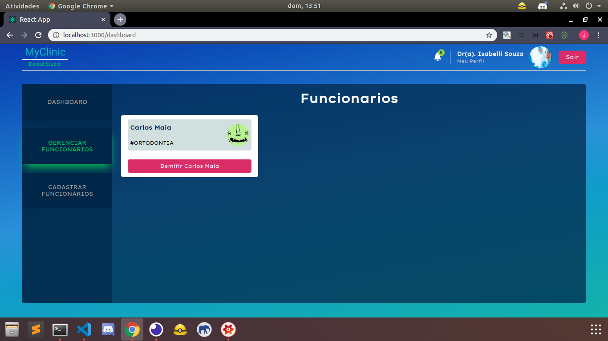
  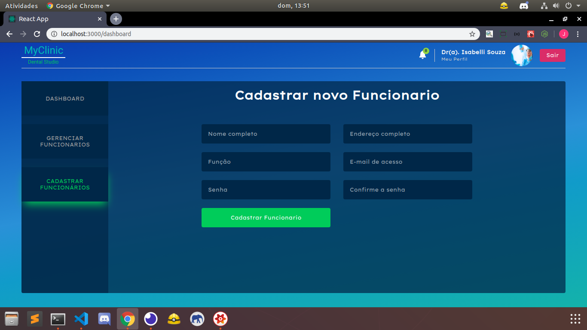
  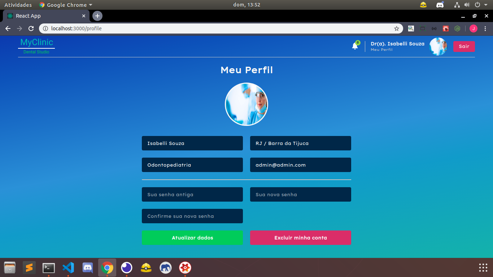

  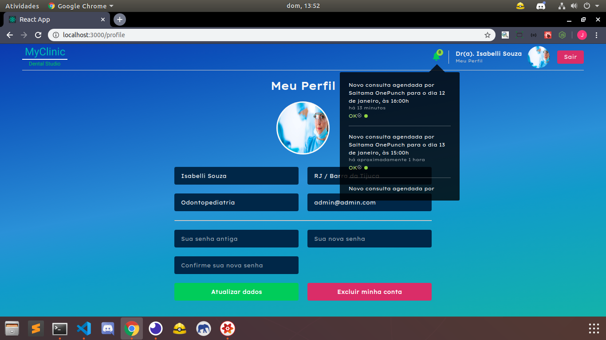
  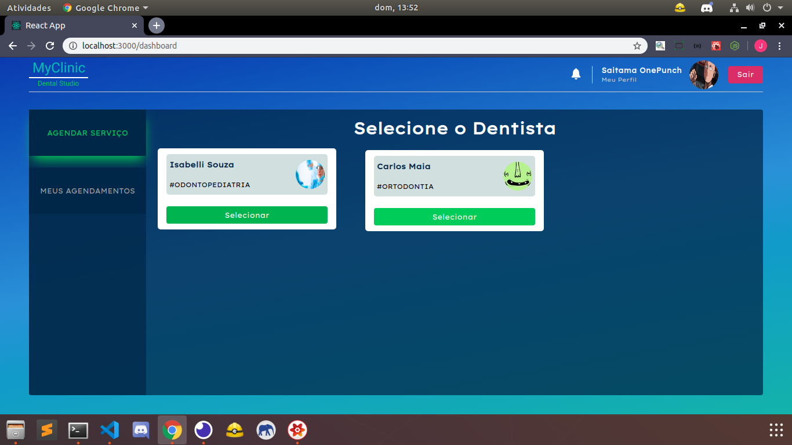
  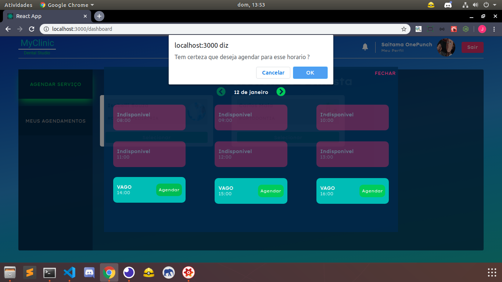
  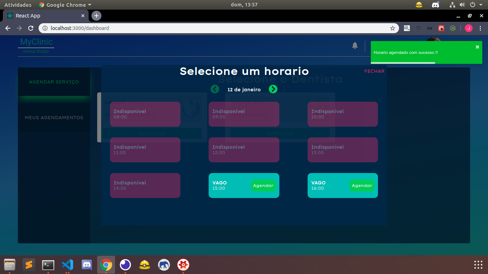
  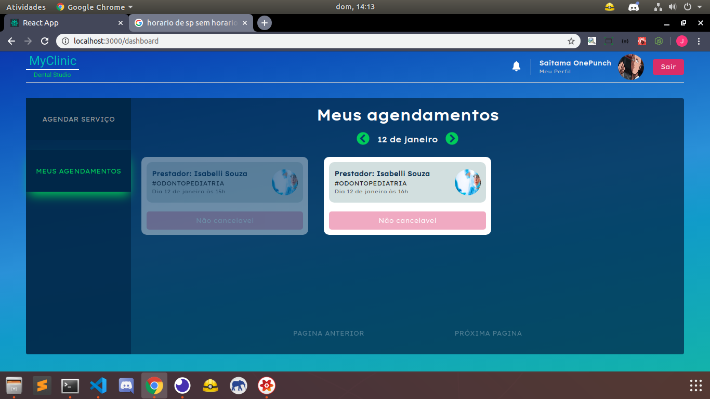
  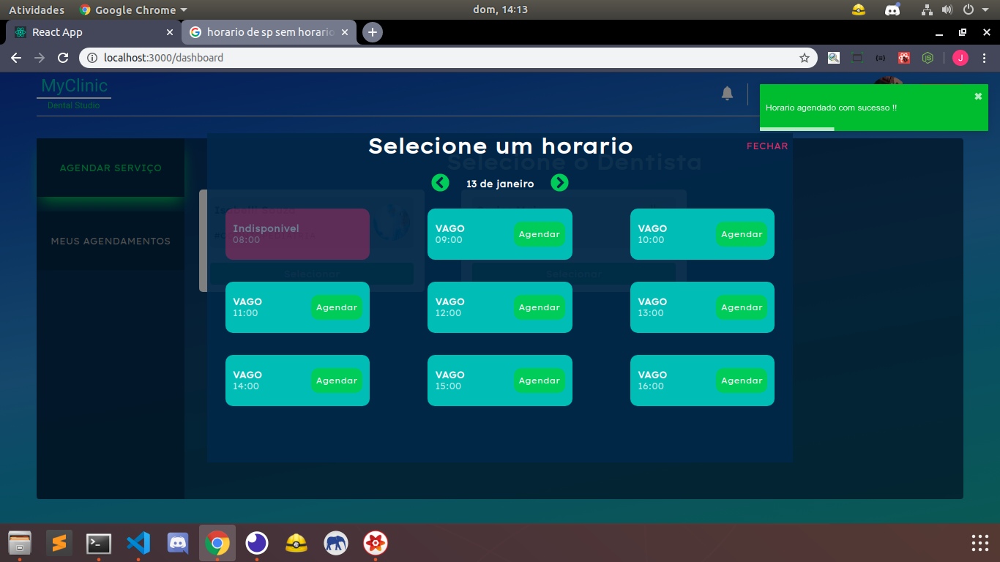
  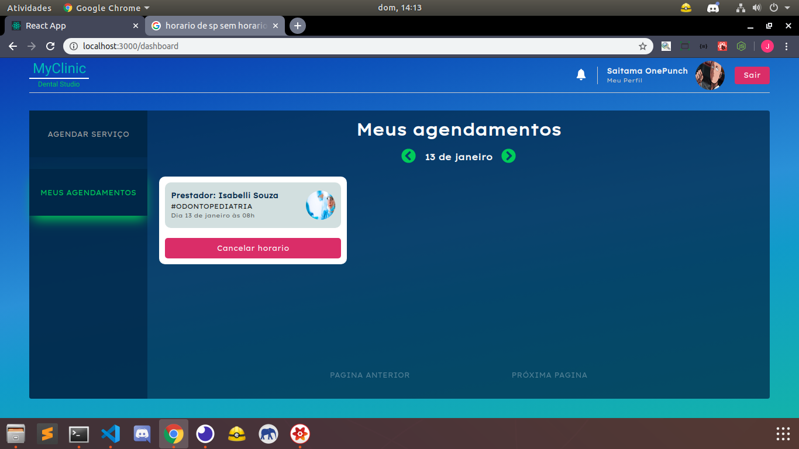
  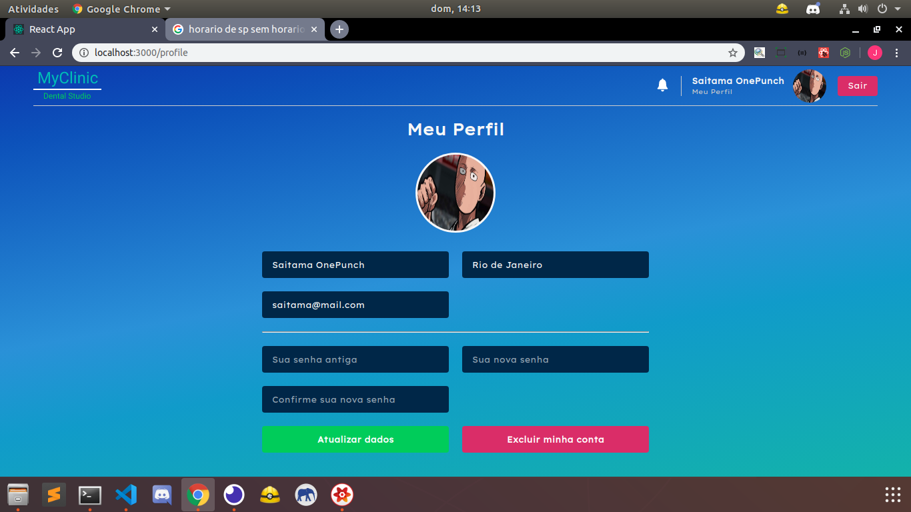

