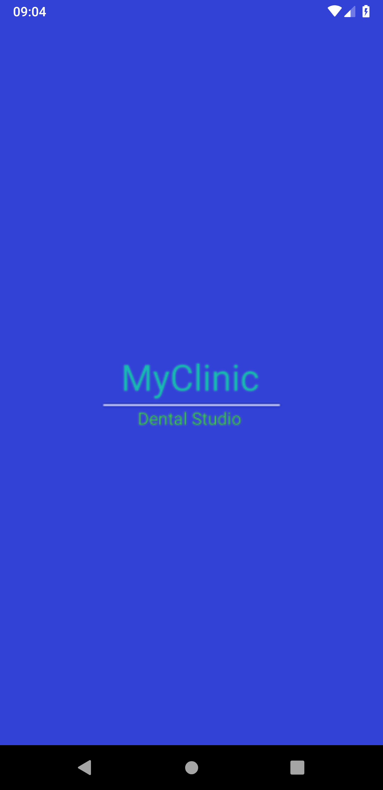
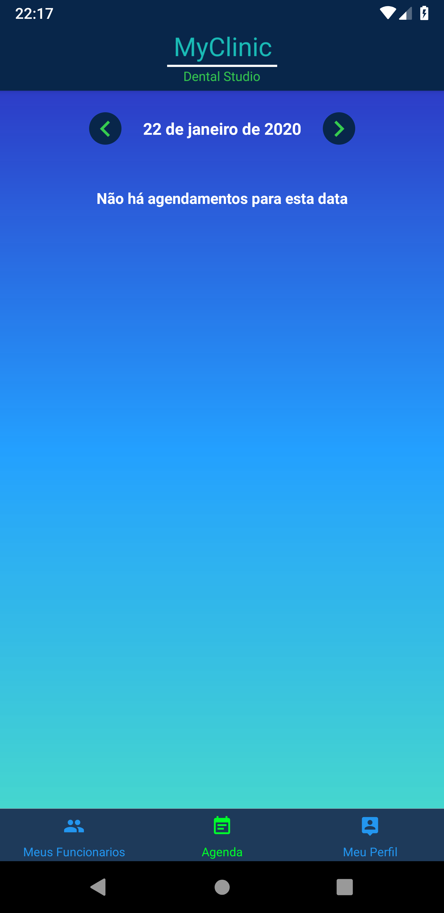
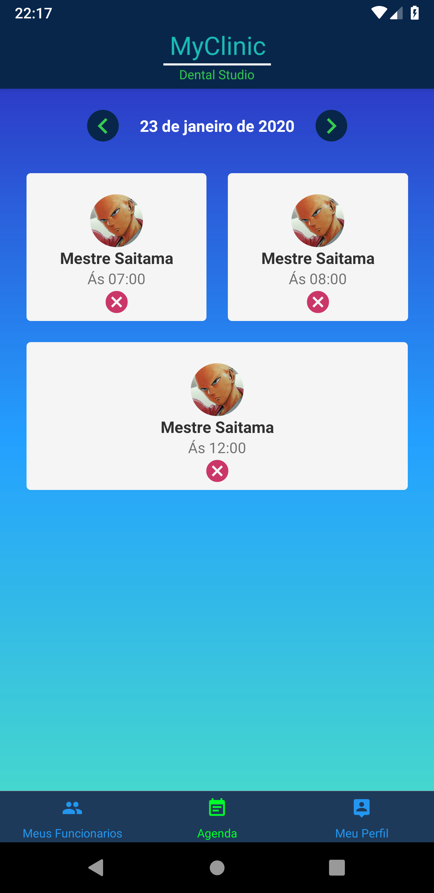
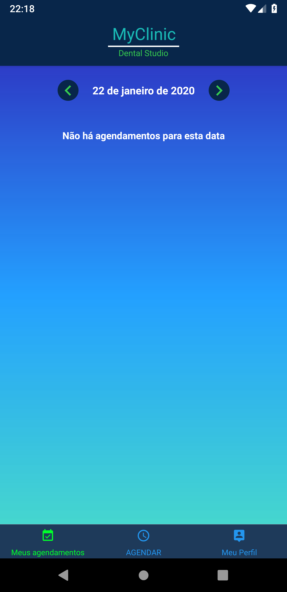
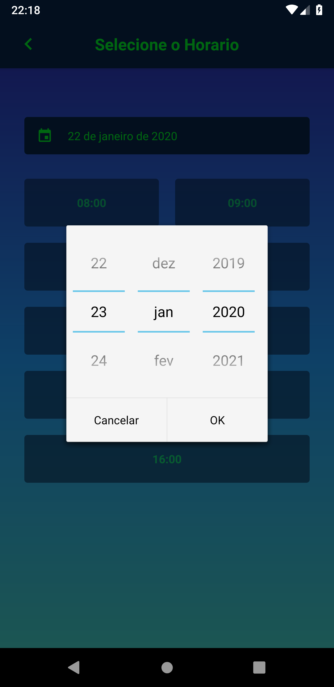
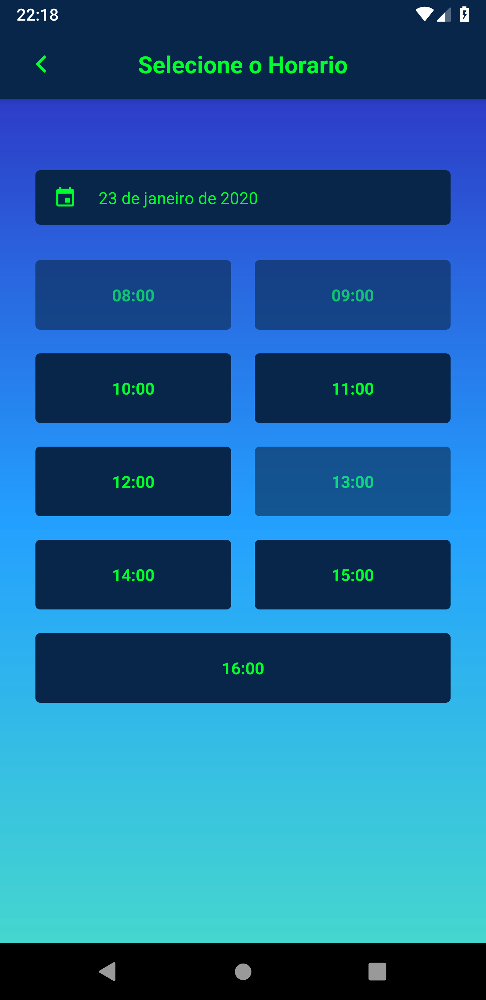

<h1> My Clinic Mobile</h1>
 

<h4>Here we have the mobile version that i did with ReactNative.</h4> 

 If the user is a doctor, then the app will return docto's version, if he is a client, client version
 

<i>DOCTORS</i>

  
  
  
  

  
  
  
  

<i>CLIENTS</i>

  
  
  
  

  
  
  

