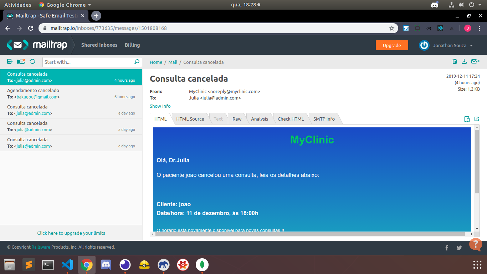
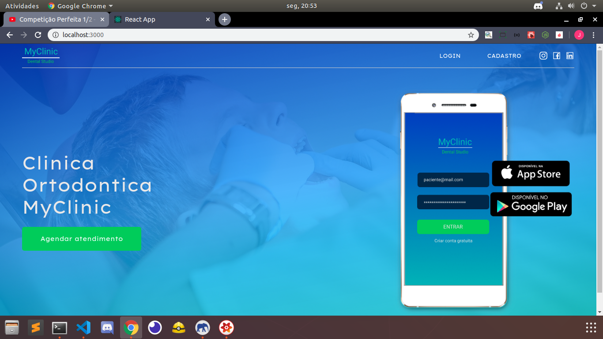
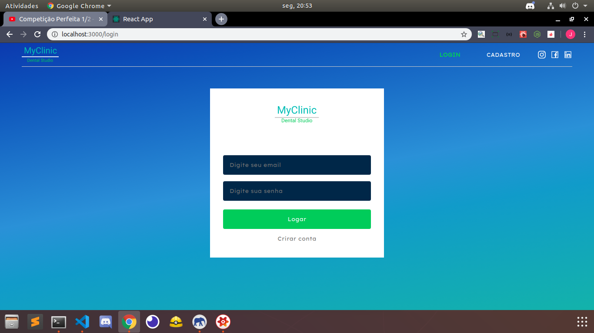
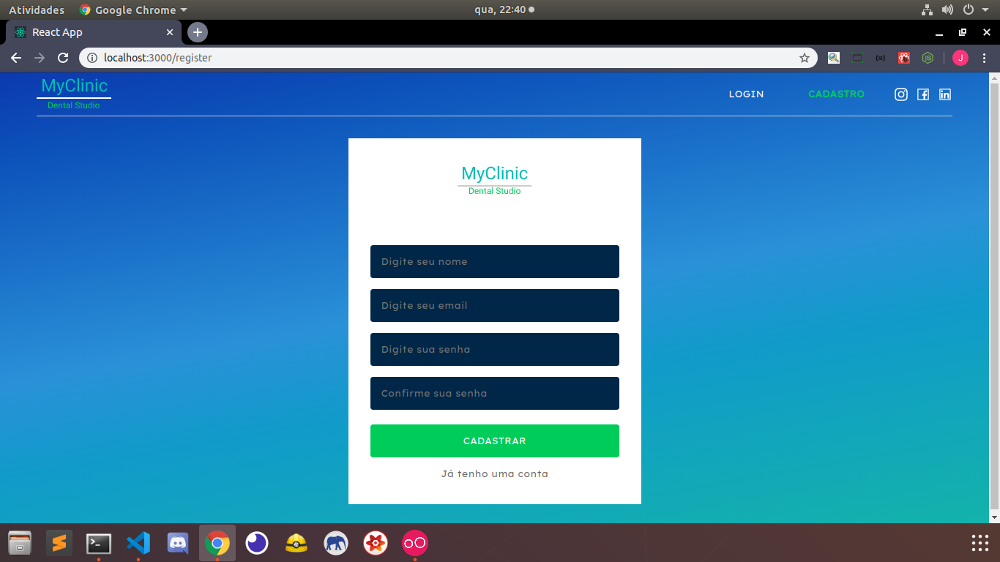

<h1>>> MyClinic <<</h1>
<i>That's my best and my favorite project, because here i did absolutely everything "including the disign", i just took a look in dribble to get an inspiration to do only my home screen, then i did everything.</i>  

<i><strong>Instructions:</strong</i>
<ul>
  <li>First step: inside backend's folder, run : "Docker-compose up"  to create containers</li>
  <li>Second step: inside backend's folder,  run: " yarn sequelize db:migrate" to create the table in your database</li>
  <li>Third step: inside backend's folder run: "yarn sequelize db:seed:all " 
  <strong>login: admin@admin.com  / pass: 123456</strong>
  </li>
  <li>Fourth:  " yarn dev " to start the back-end</li>
  <li>Fifth:  " yarn queue " to start the background jobs</li>
  <li> You can also use <strong>NPM</strong></li>
</ul>

<h2>Backend: </h2>
Finished! 
<a href="api">Api MyClinic</a>

<h4>This is an apllication to manage a clinic. Here, i worked with NodeJS + ExpressJS, postgreSQL, MongoDB and Redis<h4>
<h4>In this application, the user can create an appointment with doctor and cancel, also the doctor can cancel user's appointments sending notifications to them, and more.... <h4>  

  
  

<h2>Front-end</h2>
<strong>In this application you can manage your clinic, your schedule, your profile and your employees,  the clients can use this version too. They can create profile, read notifications,  they can manage his account and cancel appointments</strong>
 

Front-end MyClinic: <a href="https://github.com/jonathanwdev/myclinic/tree/master/FrontEnd">Read more</a> 

  
  
  

<h2>Mobile</h2>
<strong>In this application you can manage your clinic, your schedule, your profile and your employees, the clients can use this version too. They can create profile, they can manage his account and cancel appointments</strong>
 

MyClinic Mobile: <a href="https://github.com/jonathanwdev/myclinic/tree/master/Mobile"> Read more </a> 

  
  

